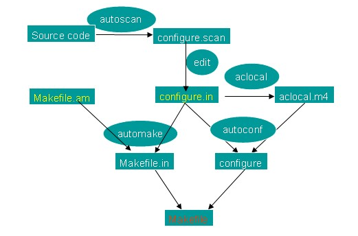

**CMake的定义**：一个跨平台、开源、可扩展的软件编译生成系统，如果您熟悉与之同类的QMake（开源开发库Qt的自动工程生成工具）或者Automake（Unix系统的常见工程生成工具）的话，想必更有助于对它的深入了解。用一句话来描述的话，CMake的工作就是：辅助生成不同平台上的Makefile脚本，从而建立整个软件工程的编译生成规则，以及它内部以及它与其它软件工具之间的依赖关系。

Windows的程序开发同样离不开Makefile的概念。事实上，那些层出不穷的强大得令人眼花缭乱的IDE环境（譬如，家喻户晓的Visual Studio）为开发者们提供了太多的便利条件，以至于大家都渐渐学得好吃懒做起来——按个按钮，找个菜单项，或者极不情愿地在命令窗口中输入一串“start”字符……一切就可尽在掌握？抱歉，这世界上不会有那么多的便宜事。

更多的时候，您不得不用着最简陋的文本编辑器，一行一行敲击，一行一行地耕耘。

一个工程中的源文件不计其数，其按类型、功能、模块分别放在若干个目录中，makefile定义了一系列的规则来指定，哪些文件需要先编译，哪些文件需要后编译，哪些文件需要重新编译，甚至于进行更复杂的功能操作，因为 makefile就像一个Shell脚本一样，其中也可以执行操作系统的命令。

CMake的核心是脚本配置文件，也就是CMakeLists.txt这个简单的脚本文件，浏览一下OpenSceneGraph的源代码目录就可以发现，从根目录开始，几乎每一个包含了子工程源代码的目录（src，examples，applications等）都会同时附带一个CMakeLists.txt。在Windows下编译OSG时，只要轻松地将根目录的CMakeLists.txt拖动到CMake-GUI的窗口中，再进行相应的选项设置，就能够生成OSG的VisualStudio工程文件（或者，以笔者的喜好，生成nmake可用的Makefile文件），进而编译得到OSG动态链接库。

但是，试图直接使用子目录的CMakeLists.txt却是无效的，原因很简单，系统找不到许多在根目录的CMakeLists文件中配置的参数和宏，因而会产生错误提示，无法继续执行。

------

CMake包含了以下几个基本概念：

CMakeLists.txt

之前已经简单地介绍过了，这是CMake脚本代码和配置参数的载体，源代码目录中没有它的话，一个工程就不可能使用CMake的配置程序来完成自动Makefile脚本的生成工作。

源码树和二进制树

源代码树（Source Tree）和二进制树（Binary Tree）的含义很好理解：前者表达了一个工程的所有头文件（.h，.hxx，.hh，无扩展名，等等），源文件（.c，.cc，.cpp，.cxx，等等），CMake脚本（CMakeLists.txt），以及它们的目录树结构；后者则包括平台相关的解决方案或Makefile脚本，目标文件（.obj），编译后的动态/静态库和可执行文件，以及其它编译过程中生成的文件等。

CMake允许“源码树内生成”（in-source build）和“源码树外生成”（out-of-source build）这两种工作方式。前者将会在源代码的同一目录下生成对应的Makefile脚本，目标文件以及结果；后者则是在不同的目录下执行编译生成的工作，源代码树则保持原样，十分有利于代码的版本更新，搜索管理，以及打包再发布。

对于Windows用户，可以在CMake-GUI的“Where to build binaries”栏中输入新的工作路径以实现out-of-source的模式；Linux用户则可以简单地在外部目录执行cmake指令，例如：

\# cmake /home/myproject –DCMAKE_BUILD_TYPE=Release

这里的/home/myproject即是工程的根目录，其中必须包含有CMakeLists.txt文件。

对于发展和功能增补十分迅速的OSG而言，“源码树外生成”当然是首选的编译方案。这样的话，当我们不满于动辄上G的临时文件容量之时，只需要随手删除其所在目录即可，不会影响到OSG源代码分毫。

------

CMakeModules模块

一个工程需要依赖于另一个工程的头文件和库文件（.lib），无论对商业还是开源软件的开发流程来说，这都是不可或缺的一部分：GUI开发库Qt的部分功能依赖于libJPEG、libPNG；商业GIS引擎Skyline依赖于GDAL；就连微软的一些大型游戏都会依赖于开源工程OpenAL。

那么，如何告诉我们的工程，这些头文件和LIB文件的位置呢？熟悉Visual Studio环境的朋友当然知道，在工程属性的“C/C++”和“链接器”选项卡中，可以分别设置它们的路径；而Linux编程时，则需要在脚本中手动添加-I以及-L、-l参数，保证#include宏不致无所适从，以及编译器不会产生该死的LNK2001，LNK2019错误。

而对于使用CMake生成自动脚本的开发者来说，寻找头文件和库文件的工作，就交给CMakeModules中的各个模块来完成。

在OSG的根目录下有一个不太引人注意的子目录文件夹，就是这个CMakeModules。其中的文件内容十分丰富，名称则一目了然：FindFreeType.cmake，FindGDAL.cmake，诸如此类。倘若用户机的设置得当，这些扩展名为.cmake的搜索脚本可以自动获取依赖库的路径信息（但是并不会主动将它们追加到工程属性中）；不然的话，我们在配置OSG时屡屡需要设置的FREETYPE_INCLUDE_DIR，GDAL_LIBRARY等选项，也是出自这些脚本的手笔。

具体的搜索脚本阅读和编写方法稍后再说。感兴趣的朋友不妨现在就用文本编辑工具打开一瞧，没准它们也并不像您想象的那样复杂也说不定。

------

CMake基本宏

细心的您想必已经发现了，前文我们在描述Linux下的CMake命令行时，有一个未作介绍的宏参数：-DCMAKE_BUILD_TYPE=Release。它可以被简单地分割为三个部分，-D是命令前缀词，CMAKE_BUILD_TYPE是宏命令的关键字，而Release则是对其赋值。这个内置宏标志的含义应当说不言而喻，它设置了工程即将采用的编译类型，可使用的值通常包括Debug、Release、RelWithDebInfo和MinSizeRel四种。和我们在Visual Studio等工具中所作的设置相似，这将改变工程的调试等级和编译生成的信息等诸多内容。

除了CMAKE_BUILD_TYPE之外，CMake中还包含一些基本的内置宏指令，典型的例如：

CMAKE_LIBRARY_PATH，设置自动查找依赖工程库文件的额外路径，默认为脚本中指定的搜索路径。

CMAKE_INCLUDE_PATH，设置自动查找依赖工程头文件的额外路径，默认为脚本中指定的搜索路径。

CMAKE_MODULE_PATH，设置搜索CMakeModules模块（.cmake）的额外路径。

CMAKE_INSTALL_PREFIX，设置安装时的路径。这是一个重要的配置参数，当链接库和可执行文件的生成工作完毕时，往往需要将这些.lib，.dll，.exe和头文件拷贝到一个独立的文件夹下，以备调用和再次复制。在Visual Studio环境下我们通过INSTALL工程来完成这一安装工作；而Unix/Linux下则是熟悉的make install。默认的安装目录为/usr/local/或者C:/Program Files/。

------

CMake缓存信息

当我们使用CMake生成了工程的解决方案或者Makefile脚本之后，再进入二进制树目录，也就是编译过程文件存储的位置（in-source模式为源代码同一目录，out-of-source模式为用户自行指定的文件夹），可以看到新生成的CMakeCache.txt文件，即缓存信息文件。

CMakeCache.txt中存储了所有自动搜索或者手动配置的路径和脚本参数。当我们更新了工程的源代码，并准备重新进行编译时；使用这种缓存信息文件可以有效地加速CMake配置的过程，方法是直接将这个文件拖动到CMake-GUI窗口中，或者在命令行方式下执行：

\# cmake –C CMakeCache.txt

此时系统将自动读入上一次配置的所有信息，使用CMake-GUI的用户可以在对话框中再次进行参数的修改，并生成新的解决方案或者Makefile文件，以供下一步的工程编译生成工作。