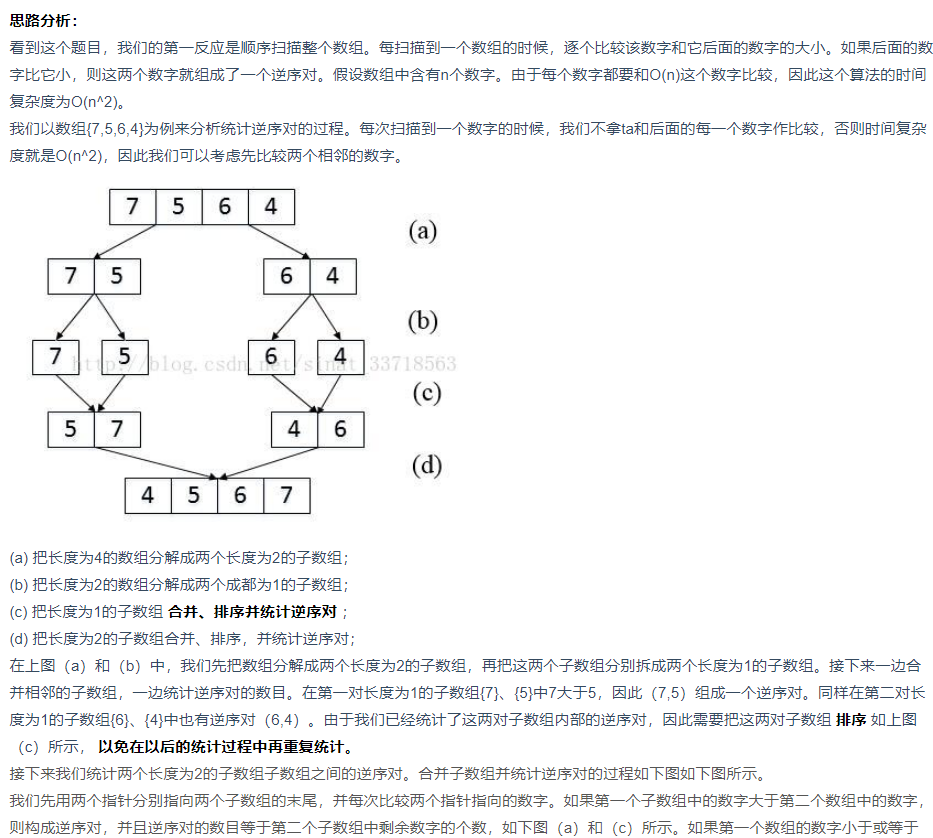
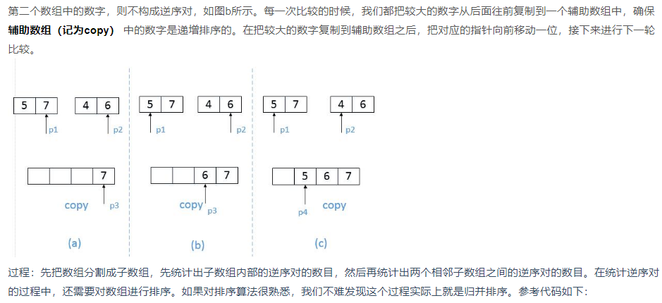

**一、二维数组中的查找**：

在一个二维数组中（每个一维数组的长度相同），每一行都按照从左到右递增的顺序排序，每一列都按照从上到下递增的顺序排序。请完成一个函数，输入这样的一个二维数组和一个整数，判断数组中是否含有该整数。


解题思路：不从最左上端开始，而是从最左下端开始，因为**全局有序**，这样当前位置小于target则向右，大于target则向上，无论如何最多遍历m+n此就能找到结果。


***

**十三、调整数组顺序使奇数位于偶数前面。**


输入一个整数数组，实现一个函数来调整该数组中数字的顺序，使得所有的奇数位于数组的前半部分，所有的偶数位于数组的后半部分，并保证奇数和奇数，偶数和偶数之间的相对位置不变。


解题思路：因为确保相对位置不变，即**稳定性**，所以考虑另开两个数组，分别存放奇数和偶数，再压回到原数组中，时间空间复杂度都是O(n)。

另一个值得注意使得思路是**类似冒泡排序**，冒泡排序排的是大小，这个排的奇偶，即将前偶后奇的情况交换，其余不动。

```C++
for(int i = 0;i < array.size();i++){     
    for(int j = array.size()-1; j>i;j--){         
        if(array[j]%2==1&&array[j-1]%2==0)             
            swap(array[j],array[j-1]);     
    } 
} 
```


***

十九、顺时针打印矩阵：

输入一个矩阵，按照从外向里以顺时针的顺序依次打印出每一个数字，例如，如果输入如下4 X 4矩阵： 1 2 3 4 5 6 7 8 9 10 11 12 13 14 15 16 则依次打印出数字1,2,3,4,8,12,16,15,14,13,9,5,6,7,11,10.

 1   2   3   4

 5   6   7   8

 9  10 11 12

13 14 15 16


解题思路：顺时针打印，即从左向右，从上向下打印，设left，right，top，bottom，打印完毕，各自加减，**使得矩阵变小一圈。**

注意事项：**判断是否重复打印。**

- - 如果只有一行，则从左向右打印后，则不必再从后向前打印了。
  - 如果只有一列，则从上向下打印后，则不必再从下向上打印了。


***

**二十八、数组中出现次数超过一半的数字：**

数组中有一个数字出现的次数超过数组长度的一半，请找出这个数字。例如输入一个长度为9的数组{1,2,3,2,2,2,5,4,2}。由于数字2在数组中出现了5次，超过数组长度的一半，因此输出2。如果不存在则输出0。


解题思路：利用一个set集合，先把出现的所有数字记录下来，根据每个数字都遍历一遍求数组中的出现的次数，大于1/2直接跳出。

另外用map来做，自己遍历的时间减少了，变成了map内部查找的耗时。总的来说STL的实现应该更比自己写高效。

这道题还有一种思路叫做**moore voting**，可以研究一下，但是本题的判例给的不好，判例里面有的数组，没有出现次数超过一半的数。

这样的话，把这个数存起来，再遍历一遍数组即可，**总的复杂度还是O(n)**

可以参考<https://blog.csdn.net/huanghanqian/article/details/74188349>

***

二十九、最小的k个数：

输入n个整数，找出其中最小的K个数。例如输入4,5,1,6,2,7,3,8这8个数字，则最小的4个数字是1,2,3,4,。


解题思路：直接将输入的数组排序，之后输出。**可以练练几种基本的排序算法。**


***

**三十、连续子数组的最大和：**

HZ偶尔会拿些专业问题来忽悠那些非计算机专业的同学。今天测试组开完会后,他又发话了:在古老的一维模式识别中,常常需要计算连续子向量的最大和,当向量全为正数的时候,问题很好解决。但是,如果向量中包含负数,是否应该包含某个负数,并期望旁边的正数会弥补它呢？例如:{6,-3,-2,7,-15,1,2,2},连续子向量的最大和为8(从第0个开始,到第3个为止)。给一个数组，返回它的最大连续子序列的和，你会不会被他忽悠住？(子向量的长度至少是1)


解题思路：可以用暴力解，时间复杂度是O(n^2)。最简单的动规题，记一个包含当前位置元素的最大子序列和，和一个到当前位置为止，最大的子序列和。

使用动态规划

**F（i）：以array[i]为末尾元素的子数组的和的最大值，子数组的元素的相对位置不变**

F（i）=max（F（i-1）+array[i] ， array[i]）

**res：所有子数组的和的最大值**

res=max（res，F（i））


如数组[6, -3, -2, 7, -15, 1, 2, 2]

初始状态：

​    F（0）=6

​    res=6

i=1：

​    F（1）=max（F（0）-3，-3）=max（6-3，3）=3

​    res=max（F（1），res）=max（3，6）=6

i=2：

​    F（2）=max（F（1）-2，-2）=max（3-2，-2）=1

​    res=max（F（2），res）=max（1，6）=6

i=3：

​    F（3）=max（F（2）+7，7）=max（1+7，7）=8

​    res=max（F（2），res）=max（8，6）=8

i=4：

​    F（4）=max（F（3）-15，-15）=max（8-15，-15）=-7

​    res=max（F（4），res）=max（-7，8）=8

以此类推

最终res的值为8

```C++
int res = array[0]; 
//记录当前所有子数组的和的最大值 
int currentMax = array[0];   
//包含array[i]的连续数组最大值 
for (int i = 1; i < array.size(); i++) {     
    currentMax = max(currentMax+array[i], array[i]);    
    res = max(currentMax, res)；     
}
return res; 
```


***

三十五、数组中的逆序对：

在数组中的两个数字，如果前面一个数字大于后面的数字，则这两个数字组成一个逆序对。输入一个数组,求出这个数组中的逆序对的总数P。并将P对1000000007取模的结果输出。 即输出P%1000000007

**输入描述:** 题目保证输入的数组中没有的相同的数字，数据范围：

​	对于%50的数据,size<=10^4

​	对于%75的数据,size<=10^5

​	对于%100的数据,size<=2*10^5


解题思路：基本看缘分，**希望能搞清楚原理，到时候说一哈。**






***

**三十七、数字在排序数组中出现的次数：**

统计一个数字在排序数组中出现的次数。


解题思路：

1、因为是**排序数组找东西，考虑二分查找**。

2、因为data中都是整数，所以可以稍微变一下，不是搜索k的两个位置，而是**搜索k-0.5和k+0.5**,这两个数应该插入的位置，然后相减即可。

​        

```C++
return (binarySearch(data,k+0.5) - binarySearch(data,k-0.5)); 
```


***

四十、数组中只出现一次的数字：

一个整型数组里除了两个数字之外，其他的数字都出现了偶数次。请写程序找出这两个只出现一次的数字。


解题思路：差不多，直接用map来统计。

**注意map::iterator的使用it->first,it->second**

```C++
for(map<int,int>::iterator it = m.begin();it!=m.end();it++){     
    if(it->second == -1){         
        temp.push_back(it->first);     
    } 
} 


```

***

四十一、和为S的连续正数序列：

小明很喜欢数学,有一天他在做数学作业时,要求计算出9~16的和,他马上就写出了正确答案是100。但是他并不满足于此,他在想究竟有多少种连续的正数序列的和为100(至少包括两个数)。没多久,他就得到另一组连续正数和为100的序列:18,19,20,21,22。现在把问题交给你,你能不能也很快的找出所有和为S的连续正数序列? Good Luck!


解题思路：这个题一般来说可以用暴力解，只是需要捋一捋可能的情况，但是复杂度并没有高很多。

应该注意的是：**左神的想法，双指针法。**两个起点相当于滑动窗口的两边，根据窗口内的值的和来确定窗口的大小。小于sum，右指针向右移，大于sum，左指针向右移，知道两指针相遇。也即遍历到sum。

```C++
vector<vector<int> > FindContinuousSequence(int sum) {         
    //左神的思路，双指针法         
    //存放结果         
    vector<vector<int> > result;         
    //两个起点，相当于动态窗口的两边，根据其窗口内的值的和来确定窗口的位置和大小         
    int plow = 1, phigh = 2;        
    while(plow<phigh){             
        //由于是连续的等差数列，求和公式(a0+an)*n/2           
        int cur = (phigh + plow) * (phigh - plow + 1)/2;        
        //如果相等，就把窗口内的所有数都添加进结果集       
        if(cur == sum){             
            vector<int> list;          
            for(int i=plow;i<=phigh;i++){         
                list.push_back(i);              
            }                 
            result.push_back(list);            
            phigh++;            
        }             
        //如果当前窗口内之和小于sum，那么右边窗口右移             
        else if(cur<sum){                
            phigh++;             
        }             
        //如果当前窗口内之和大于sum，那么左边窗口右移             
        else{                 
            plow++;             
        }         
    }         
    return result;     
} 
```


***

四十二：和为S的两个数字，是之乘积最小：

输入一个递增排序的数组和一个数字S，在数组中查找两个数，使得他们的和正好是S，如果有多对数字的和等于S，输出两个数的乘积最小的。


解题思路：这个题的思路基本也很简单，因为数组是排好序的，依旧是双指针法即可。但是比较巧妙的是，**当多组两个数的和相同时，两个数的值相差越大，乘积越小**。所以直接前后双指针，第一个遇到的即可。小于s时左指针右移，大于s时右指针左移。


***

四十五、扑克牌顺子：

LL今天心情特别好,因为他去买了一副扑克牌,发现里面居然有2个大王,2个小王(一副牌原本是54张^_^)...他随机从中抽出了5张牌,想测测自己的手气,看看能不能抽到顺子,如果抽到的话,他决定去买体育彩票,嘿嘿！！“红心A,黑桃3,小王,大王,方片5”,“Oh My God!”不是顺子.....LL不高兴了,他想了想,决定大\小 王可以看成任何数字,并且A看作1,J为11,Q为12,K为13。上面的5张牌就可以变成“1,2,3,4,5”(大小王分别看作2和4),“So Lucky!”。LL决定去买体育彩票啦。 现在,要求你使用这幅牌模拟上面的过程,然后告诉我们LL的运气如何， 如果牌能组成顺子就输出true，否则就输出false。为了方便起见,你可以认为大小王是0。


解题思路：先排序，**统计王的个数，统计数字之间的间隔**。当有两个数字相同时（且不为零），即出现对子，就返回。如果间隔总数小于王的总数，则是顺子。

一共有四张牌王，所以最多到最后一张才抽到普通牌，这种情况下，还是顺子。

O(nlogn)


***

五十、数组中重复的数字：

在一个长度为n的数组里的所有数字都在0到n-1的范围内。 数组中某些数字是重复的，但不知道有几个数字是重复的。也不知道每个数字重复几次。请找出数组中任意一个重复的数字。 例如，如果输入长度为7的数组{2,3,1,0,2,5,3}，那么对应的输出是第一个重复的数字2。


解题思路：用一个**set**来存每个数字，当插入set中时，set.size()没发生变化，则说明重复了。

```C++
size = s.size(); 
s.insert(numbers[i]); 
if(size == s.size()) {      
    *duplication = numbers[i];      
    return true; 
} 
```


***


五十一、构建乘积数组：

给定一个数组A[0,1,...,n-1],请构建一个数组B[0,1,...,n-1],其中B中的元素B[i]=A[0]*A[1]*...*A[i-1]*A[i+1]*...*A[n-1]。不能使用除法。


解题思路：判断清楚各种情况（一个数又没有，只有一个数，有两个以上。。。）具体解答没什么可说O(n^2)