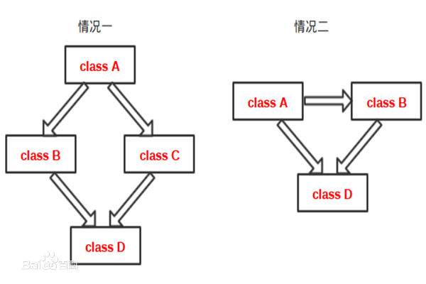

1、自动变量，只在定义它们的时候才创建，在定义它们的 [函数](http://baike.baidu.com/view/15061.htm) 返回时系统回收变量所占 [存储空间](http://baike.baidu.com/view/1375172.htm) 。对这些变量 [存储空间](http://baike.baidu.com/view/1375172.htm) 的分配和回收是由系统自动完成的。一般情况下，不作专门说明的 [局部变量](http://baike.baidu.com/view/552847.htm) ，均是自动变量。自动变量也可用关键字auto作出说明。


2、x&(x-1)的作用是统计x中的1的个数，x|(x+1)的作用是统计x中的0的个数。


3、实型常量又称实数或浮点数;有两种表示形式，分别为小数形式和指数形式;本题为指数形式，**E(e)前面为十进制整数或实数且不能省略，E(e)后面为十进制整数且不能为实数且不能省略。**


4、所谓的接口是指**只包含纯虚函数的抽象类**，和普通的抽象类含不一样。**接口是特殊的抽象类**，抽象类的唯一作用就是创建派生类，不能定义抽象类的对象。


5、**非常量引用的初始值必须为左值**！一个区分左值与右值的便捷方法是：**看能不能对表达式取地址，如果能，则为左值**，否则为右值。


6、

```C++
int a1,a2;
char c1,c2;
scanf("%d%c%d%c",&a1,&c1,&a2,&c2)；

10A20B↙
```

scanf用于输入整数时，当遇到非数字字符结束，此时非数字字符将存入键盘缓冲区，如果接着读入字符，将从键盘缓冲区中读取该字符。对于C的输入，10后面是字符’A'，则将10给a1，'A’就赋给c1，20赋给a2，’B’赋给c2.所以正确的输入方法是C。


7、

```C++
printf("%x,%o,",ch,ch,k);//将ch以16进制输出为61,八进制为141，k参数被忽略。

printf("k=%%d\n",k);   // %是控制符，用 %% 表示输出一个百分号。
```


8、循环的判断条件是一个赋值语句n=0，**C/C++中0为假，非0为真**；故该循环判断恒为假，循环体一次也不执行。（同理选择语句**？：**）


9、窗口句柄就相当于一个身份证，是一个整数，如果两个窗口的句柄相同的话，就会出现消息不知道传给哪个窗口了。


10、switch后面的“表达式”，可以是int、char和枚举型中的一种，不能是float型变量；case后面必须是“常量表达式”，表达式中不能包含变量。


11、**未定义行为（Undefined Behavior）是指C语言标准未做规定的行为**。同时，标准也从没要求编译器判断未定义行为，所以这些行为有编译器自行处理，在不同的编译器可能会产生不同的结果，又或者如果程序调用未定义的行为，可能会成功编译，甚至一开始运行时没有错误，只会在另一个系统上，甚至是在另一个日期运行失败。


12、面向对象的五个基本原则： 

**单一职责原则**（Single-Resposibility Principle）：一个类，最好只做一件事，只有一个引起它的变化。单一职责原则可以看做是低耦合、高内聚在面向对象原则上的引申，将职责定义为引起变化的原因，以提高内聚性来减少引起变化的原因。 

**开放封闭原则**（Open-Closed principle）：软件实体应该是可扩展的，而不可修改的。也就是，对扩展开放，对修改封闭的。 

**Liskov替换原则**（Liskov-Substituion Principle）：子类必须能够替换其基类。这一思想体现为对继承机制的约束规范，只有子类能够替换基类时，才能保证系统在运行期内识别子类，这是保证继承复用的基础。 

**依赖倒置原则**（Dependecy-Inversion Principle）：依赖于抽象。具体而言就是高层模块不依赖于底层模块，二者都同依赖于抽象；抽象不依赖于具体，具体依赖于抽象。 

**接口隔离原则**（Interface-Segregation Principle）：使用多个小的专门的接口，而不要使用一个大的总接口。


13、一个算法应该具有以下5个特性：**有穷性、确定性、可行性、有零个或多个输入、有一个或多个输出**。因此一个算法可以没有输入(程序的功能确定)，但必须要有输出，没有输出的算法是没有意义的。


14、**类的大小只与成员变量（非static数据成员变量）和虚函数指针有关，还要考虑到对齐。**


15、一个算法有0个或多个输入 有一个或多个输出。


16、多重继承图示：（以左边为例）




多重继承定义：

一个派生类（D）有2个或2个以上的基类（B和C）；


多重继承引起的二义性：

假如上述这些基类（B和C）具有相同的基类A，A中的成员数据和成员函数，最终都会以双份的形式拷贝到类D中，

那么调用的时候就会出现二义性问题。


虚基类：

专门用来解决多重继承引起的二义性问题；（可以理解为D直接从A继承）

虚基类的具体实现的注意细节有很多，这里不再列举了，我认为只需要了解原理即可。


17、mutalbe的中文意思是“可变的，易变的”，跟constant（既 [C](http://product.yesky.com/product/225/225032/) ++中的const）是反义词。 


**在C++中，mutable也是为了突破const的限制而设置的。被mutable修饰的变量，将永远处于可变的状态，即使在一个const函数中。** 


我们知道，如果类的成员函数不会改变对象的状态，那么这个成员函数一般会声明成const的。但是，有些时候，我们需要在const的函数里面修改一些跟类状态无关的数据成员，那么这个数据成员就应该被mutalbe来修饰。

***

18、**C++11 STL中的容器**

==================================================

**一、顺序**容器：

**vector：**可变大小数组；

**deque：**双端队列；

**list：**双向链表；

**forward_list：**单向链表；

**array**：固定大小数组；

**string**：与vector相似的容器，但专门用于保存字符。

==================================================

**二、关联**容器：

按**关键字有序**保存元素：（底层实现为**红黑树**）

**map：**关联数组；保存关键字-值对；

**set：**关键字即值，即只保存关键字的容器；

**multimap：**关键字可重复的map；

**multiset：**关键字可重复的set；

\--------------------------------------------------------------------------------

**无序**集合：

**unordered_map：**用哈希函数组织的map；

**unordered_set：**用哈希函数组织的set；

**unordered_multimap：**哈希组织的map；关键字可以重复出现；

**unordered_multiset：**哈希组织的set；关键字可以重复出现。

==================================================

三、容器适配器和其他：

**stack、queue、valarray、bitset**

***

19、**static_cast 的用法**

static_cast < type-id > ( expression )

该运算符把expression转换为type-id类型，但没有运行时类型检查来保证转换的安全性。它主要有如下几种用法：

①用于[类层次结构](http://baike.baidu.com/view/2405425.htm)中基类（父类）和[派生类](http://baike.baidu.com/view/535532.htm)（子类）之间指针或引用的转换。

进行上行转换（把派生类的指针或引用转换成基类表示）是安全的；

进行下行转换（把基类指针或引用转换成[派生类](http://baike.baidu.com/view/535532.htm)表示）时，由于没有动态类型检查，所以是不安全的。

②用于基本数据类型之间的转换，如把int转换成char，把int转换成enum。这种转换的安全性也要开发人员来保证。

③把空指针转换成目标类型的空指针。

④把任何类型的表达式转换成void类型。

注意：static_cast不能转换掉expression的const、volatile、或者__unaligned属性。


C++中的static_cast执行非[多态](http://baike.baidu.com/view/126521.htm)的转换，用于代替C中通常的转换操作。因此，被做为显式[类型转换](http://baike.baidu.com/view/1229921.htm)使用。


C++中的reinterpret_cast主要是将数据从一种类型的转换为另一种类型。所谓“通常为操作数的位模式提供较低层的重新解释”也就是说将数据以[二进制](http://baike.baidu.com/view/18536.htm)存在形式的重新解释。

***

20、**纯虚函数可以有函数体，但函数体必须定义在类的外部!!!(C++ Primer)**


21、源码 ->（扫描）-> 标记 ->（语法分析）-> 语法树 ->（语义分析）-> 标识语义后的语法树 ->（源码优化）-> 中间代码 ->（代码生成）-> 目标机器代码 ->（目标代码优化）-> 最终目标代码


22、**一个空类默认一定生成构造函数,拷贝构造函数,赋值操作符,引用操作符,析构函数**

析构函数可以为virtual,不可以重载，但可以被重写


23、“printf（%5s）” ，最少输出5位，不足时左侧补空格，大于5时全输出； 

“ printf（%-5s ）” ，最少输出5位，不足时右侧补空格，大于5时全输出；

“ printf（%.5s） ” ，最多输出5位


24、首先使用scanf读取键盘输入，因scanf在读取字符串时，**遇到空白字符(空格、制表符和回车等)**会结束输入。


25、[C语言](https://www.baidu.com/s?wd=C%E8%AF%AD%E8%A8%80&tn=44039180_cpr&fenlei=mv6quAkxTZn0IZRqIHckPjm4nH00T1YLmhR3PyPhPHm4PAm4PW-W0ZwV5Hcvrjm3rH6sPfKWUMw85HfYnjn4nH6sgvPsT6KdThsqpZwYTjCEQLGCpyw9Uz4Bmy-bIi4WUvYETgN-TLwGUv3EnH6zrH63P1b3P1ndn1fzPHfvn0)写的代码程序肯定是[源程序](https://www.baidu.com/s?wd=%E6%BA%90%E7%A8%8B%E5%BA%8F&tn=44039180_cpr&fenlei=mv6quAkxTZn0IZRqIHckPjm4nH00T1YLmhR3PyPhPHm4PAm4PW-W0ZwV5Hcvrjm3rH6sPfKWUMw85HfYnjn4nH6sgvPsT6KdThsqpZwYTjCEQLGCpyw9Uz4Bmy-bIi4WUvYETgN-TLwGUv3EnH6zrH63P1b3P1ndn1fzPHfvn0) 它不能立即执行，必须经过编译成可执行代码 如果这个[源程序](https://www.baidu.com/s?wd=%E6%BA%90%E7%A8%8B%E5%BA%8F&tn=44039180_cpr&fenlei=mv6quAkxTZn0IZRqIHckPjm4nH00T1YLmhR3PyPhPHm4PAm4PW-W0ZwV5Hcvrjm3rH6sPfKWUMw85HfYnjn4nH6sgvPsT6KdThsqpZwYTjCEQLGCpyw9Uz4Bmy-bIi4WUvYETgN-TLwGUv3EnH6zrH63P1b3P1ndn1fzPHfvn0)中不含有[main函数](https://www.baidu.com/s?wd=main%E5%87%BD%E6%95%B0&tn=44039180_cpr&fenlei=mv6quAkxTZn0IZRqIHckPjm4nH00T1YLmhR3PyPhPHm4PAm4PW-W0ZwV5Hcvrjm3rH6sPfKWUMw85HfYnjn4nH6sgvPsT6KdThsqpZwYTjCEQLGCpyw9Uz4Bmy-bIi4WUvYETgN-TLwGUv3EnH6zrH63P1b3P1ndn1fzPHfvn0)，编译后的代码也是不可执行的 [C语言](https://www.baidu.com/s?wd=C%E8%AF%AD%E8%A8%80&tn=44039180_cpr&fenlei=mv6quAkxTZn0IZRqIHckPjm4nH00T1YLmhR3PyPhPHm4PAm4PW-W0ZwV5Hcvrjm3rH6sPfKWUMw85HfYnjn4nH6sgvPsT6KdThsqpZwYTjCEQLGCpyw9Uz4Bmy-bIi4WUvYETgN-TLwGUv3EnH6zrH63P1b3P1ndn1fzPHfvn0)不是[解释执行](https://www.baidu.com/s?wd=%E8%A7%A3%E9%87%8A%E6%89%A7%E8%A1%8C&tn=44039180_cpr&fenlei=mv6quAkxTZn0IZRqIHckPjm4nH00T1YLmhR3PyPhPHm4PAm4PW-W0ZwV5Hcvrjm3rH6sPfKWUMw85HfYnjn4nH6sgvPsT6KdThsqpZwYTjCEQLGCpyw9Uz4Bmy-bIi4WUvYETgN-TLwGUv3EnH6zrH63P1b3P1ndn1fzPHfvn0)的。


26、**重载的概念是：**

方法名称相同，参数个数、次序、类型不同

因此重载对返回值没有要求，可以相同，也可以不同

但是如果参数的个数、类型、次序都相同，方法名也相同，仅返回值不同，则无法构成重载


27、百科中总结的好：1. 友元是单向的。 2. 友元就是我把秘密告诉你。 3. 不能被继承和传递。

***

28、C++

* char、short、int、long、bool 基本类型都可以用于switch语句。
* float、double都不能用于switch语句。
* enum类型，即枚举类型可以用于switch语句。
* 所有类型的对象都不能用于switch语句。
* 字符串也不能用于switch语句

***

29、预处理器发现#include后，就会寻找指令后面<>中的文件名，并把这个文件的内容包含到当前的文件中，被包含的文件中的文本将替换源代码文件中的#include指令


30、**除号**的正负取舍和一般的算数一样，**符号相同为正，相异为负**：-3/16=0     16/-3=-5   

**求余**符号的正负取舍和**被除数**符号相同： -3%16=-3      16%-3=1


31、类的大小只与成员变量（非static数据成员变量）和虚函数指针*（指向虚函数表的指针）有关，还要考虑到对齐. 


32、inline函数中如果有局部变量，同时，传参给inline函数时使用表达式传参，这样，编译器在处理时会产生很多临时对象，当inline函数多次被调用时，会产生大量的扩展码，从而增加程序大小；

若这个函数被调用了一次，那么内联直接被插入到函数调用出，就直接没有了这个函数符号了，若加上优化，这一句代码可能会被优化没有，所以，可执行文件可能会减少；

如果inline函数被编译器接受，同时又没有产生以上这些副作用，那么同非内联函数相比，inline函数是用函数体直接替换，省去了函数调用的开销，加快程序执行速度。


33、case后面的语句只起到一个标号的作用，**一旦与switch后面圆括号中表达式的值匹配,就从此标号处开始执行**,而且执行完一个case后面的语句后**,若没遇到break语句,就自动进入下一个case继续执行**,而不在判断是否与之匹配,直到遇到break语句才停止执行,退出break语句.

***

34、scanf函数的标准输入格式为：scanf（格式控制字符串，地址列表）；

其中格式控制字符串的一般形式为 %[*][数据宽度][长度]类型。

1.**类型** ：%o (八进制)、%d（十进制）、%x(十六进制)、%f (字符型)、%u(无符号类型)、%c (字			符型)、%s(字符串型)

2.**数据宽度**：用十进制整数来指定字符宽度 例如

```C++
int a,b;
scanf("%5d",&a);
//当输入为1234567时，截取前面5位赋给a，则有a=12345

scanf("%4d%4d",&a,&b);
//当输入为12345678时，此时截取前4位给a，后4位给b,则有a=1234,b=5678
```

3.**长度**：长度格式符为l或h,其中l表示长整型数据例如%ld、双精度浮点数%lf，h表示的是短整型数据

当输入多个数值型数据时，如果格式控制字符串中没有非格式字符（逗号、空格等 ） 出现 ，例如scanf("%d%d",&a,&b);此时在输入数据时可以用空格、TAB或回车来表示输入数据之间的间隔，比如输入 1_2(回车) （这里下划线表示的是空格），则a=1,b=2

4.**如果格式控制字符串中有非格式字符，则输入时也需要输入相应的非格式字符**（正如本题所示的输入中含有非格式字符 a=, b= 因此在输入的时候也应该输入a=, b=)

例如

```C++
int a,b;

scanf("%d,%d",&a,&b);
//含有非格式字符逗号，在输入数据的时候就应该输入1,2  此时有a=1,b=2
```

5.**%\*,表示的是在输入数据时将会跳过这个数值**

例如

```C++
int a,b;

scanf("%d,%*d,%d",&a,&b);
//输入1,2,3 时，2将被跳过赋值，有a=1,b=3
```


35、**erase()一次只删除一个元素，返回一个迭代器指针，指向下一个元素**。


**36、**static 静态变量和静态函数都可以在类外直接访问，

extern 可以用于声明变量，但是函数声明也可以用，只不过默认就是extern而已。

const也可以修饰函数或者变量


37、排序算法：

选堆快希不稳（是不稳定的排序）

​       选堆归基（**基数排序**）不变（运行时间不发生变化，与初始排序无关）


38、右侧自增++运算符优先级高于间接访问运算符*，相当于*（s++)，而++可认为是一个字节字符的操作（地址右移）char *s = "2431" ；char c = *s++ ；即 char c = '2' ；之后s后移一位指向‘4‘。