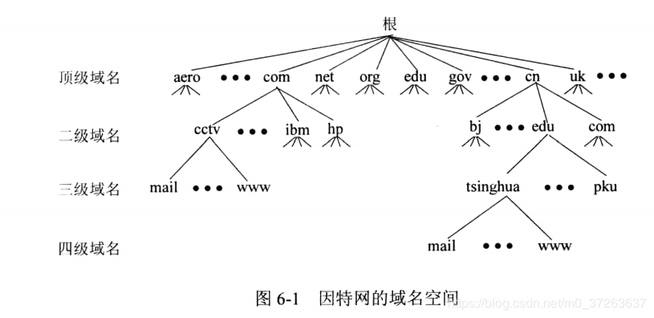

### 域名系统和DNS服务：

------

​	域名是什么，是一个网站的网址，浏览器要获取一个网页，只是知道网址是不够的，还必须知道存储网页的服务器的ip地址，从那个服务器上，下载相应的html文档，最后渲染出来。

​	那么怎么通过网址，找到对应服务器的ip地址呢？这就需要DNS服务。

​	DNS服务器是一种特殊的服务器，可以将网址通过查找转化为对应的ip地址，发还给主机，主机再根据ip地址去下载html文档。

​	DNS服务是典型的UDP协议服务，因为其不用建立连接，只需传输一个数据包即可，端口号是53。

------

​	

1. ​	由于网络通信的时延和开销，在主机的内存中会缓存一些IP地址，构成DNS缓存（掉电消失）；DNS服务会首先查缓存，当缓存中查到时，直接返回。
2. ​	另外，在主机的hosts文件中，会存储一些域名和ip地址对，查询缓存之后，会继续查本机的hosts文件。
3. ​	之后，当前两项都无法得到结果时，则会访问本地DNS服务器（一般默认配置），请求ip。这里面应该也有缓存啥的，就不再提了。如果本地DNS服务器都没有，则由本地DNS服务器向 <u>根域名服务器</u> 发送请求。 **在获取到域名对应的ip地址前，都是本地DNS服务器与外界通信，获得ip地址之后，再发还给主机。** 

------

提供DNS服务的服务器最重要的是根域名服务器：

​	全球一共13个IPv4根域名服务器，1个主根，12个辅根。其中1个主根和9个辅根在美国，剩下3个辅根，分别在日本，英国，瑞典。

​	IPv6根域名服务器，有25台。中国1个主根，3个辅根。

**<u>域名服务器的层次对应域名的层次，但两者不是对等的。</u>**

DNS服务分为：递归式和迭代式

​	递归式：直接在根域名和其他域名服务器中转发，中间结果不返回给本地DNS与服务器。

​	迭代式：本地DNS服务器，先请求根域名服务器， **返回** .所在的服务器ip；之后本地DNS服务器请求该ip，返回.com的服务器ip；之后类似的找到qq.com；再找到www.qq.com。